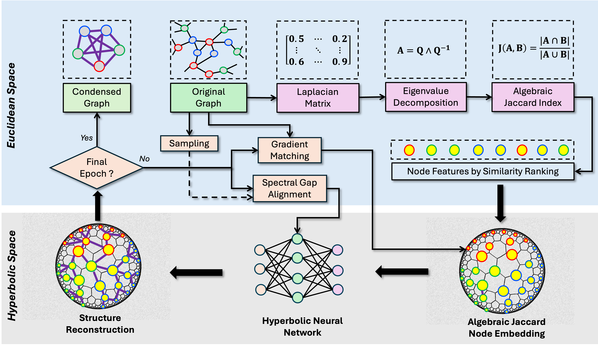

# HyDRO_Plus


## 📖 Overview

HyDRO+ builds upon the original [] framework, with several algorithmic improvements and mathematical enhancements. For more details on the foundational method and additional insights, please refer to our HyDRO paper and GitHub repository. 


2. **HyDRO+**: Efficient Privacy-Preserving Link Prediction  
   [](https://arxiv.org/html/2503.12156v1)

   
Built upon the [GraphSlim](https://github.com/Emory-Melody/GraphSlim/tree/main) framework.

## 🛠️ Installation

### System Requirements
| Component       | Version           |
|----------------|-------------------|
| PyTorch        | 1.13.1 or 2.1.2   |
| CUDA           | 12.4 (recommended)|
| Python         | ≥3.8              |

### Quick Setup

# For PyTorch 1.x
pip install -r requirements_torch1+.txt

# For PyTorch 2.x 
pip install -r requirements.txt

# Install PyG dependencies
pip install torch_scatter torch_sparse -f https://data.pyg.org/whl/torch-${TORCH}+${CUDA}.html
pip install graphslim


### Data Download

Note: The code automatically handles dataset downloads for:
- cora, citeseer, flickr, reddit (via PyG)
- arxiv (via GraphSAINT)
- Default dataset path: ../../data


## 🧪 Experiment Suite

### Core Evaluation
| Script                    | Description                          |
|---------------------------|--------------------------------------|
| `performance_HyRO.sh`     | Main distillation performance on NC tasks|
| `performance_HyDRO+.sh`  | Main distillation performance on NC tasks|


### Tasks Transferability
| Script                    | Description                          |
|---------------------------|--------------------------------------|
| `performance_LP.sh`  |Main distillation performance on LP tasks|
| `performance_AD.sh`  |Main distillation performance on AD tasks|


### Other Analysis
| Script             | Description                          |
|--------------------|--------------------------------------|
| `nas.sh`           | Neural architecture search           |
| `robustness.sh`    | Model robustness tests               |
| `mia_nodes.sh`          | Membership inference attacks on nodes |
| `mia_links.sh`          | Membership inference attacks on links |
| `cgl_eval`       | Continuous graph learning evaluation [GCondenser](https://github.com/superallen13/GCondenser) |


### Visualization & Architecture
| Script          | Description                          |
|-----------------|--------------------------------------|
| `visual.sh`    | Graph condensation visualization     |

### Graph Properties
| Script                | Description                          |
|-----------------------|--------------------------------------|
| `graph_property.sh`  | Graph property preservation          |


### ✅ To-Do List

- [ ] Commute Time Evaluation  
  - Compute and analyze commuting time using random walk evaluation on the graph.  
  - Use this as a baseline metric for downstream tasks.

- [ ] Anomaly Detection (AD) Tasks  
  - Detect anomalous nodes or edges using commuting time or other structural metrics.  
  - Evaluate using metrics like AUROC, F1, and precision-recall on labeled and unlabeled data.

- [ ] Link Prediction (LP) Tasks  
  - Use graph embeddings (possibly influenced by commuting time) to predict missing or future links.  
  - Evaluate with ROC-AUC and precision at K.  
  - Explore supervised and unsupervised methods for prediction.


## 📜 Citation

If you use HyDRO in your research, please cite our papers:

```bibtex
@article{long2025random,
  title={Random Walk Guided Hyperbolic Graph Distillation},
  author={Long, Yunbo and Xu, Liming and Schoepf, Stefan and Brintrup, Alexandra},
  journal={arXiv preprint arXiv:2501.15696},
  year={2025}
}

@article{long2025efficient,
  title={Efficient and Privacy-Preserved Link Prediction via Condensed Graphs},
  author={Long, Yunbo and Xu, Liming and Brintrup, Alexandra},
  journal={arXiv preprint arXiv:2503.12156},
  year={2025}
}
